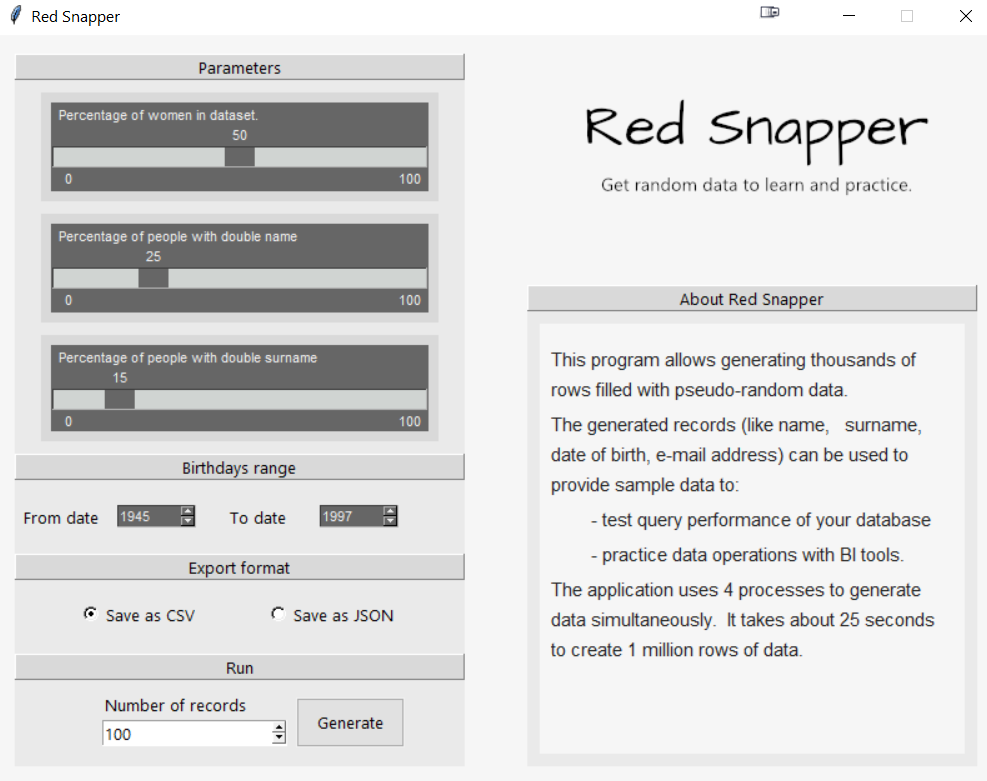

### Description
This program allows generating thousands of rows filled with pseudo-random data. 
The generated records (like name, surname, date of birth, e-mail address) can be used to provide sample data to:
- test query performance of your database
- practice data operations with BI tools.

User can select number of records to be generated and modify the parameters. 
The data can be exported as comma-separated values (CSV) or JavaScript Object Notation (JSON) format.

Program is written in Python 3 and uses Tkinter, a standard graphical user interface package. 
The application uses 4 processes to generate data simultaneously.
It takes about 25 seconds to create 1 million rows of data.

### Python dependencies
The application requires the following Python dependencies to be installed:
-	Arrow http://arrow.readthedocs.io/en/latest/
-	Numpy http://www.numpy.org/
